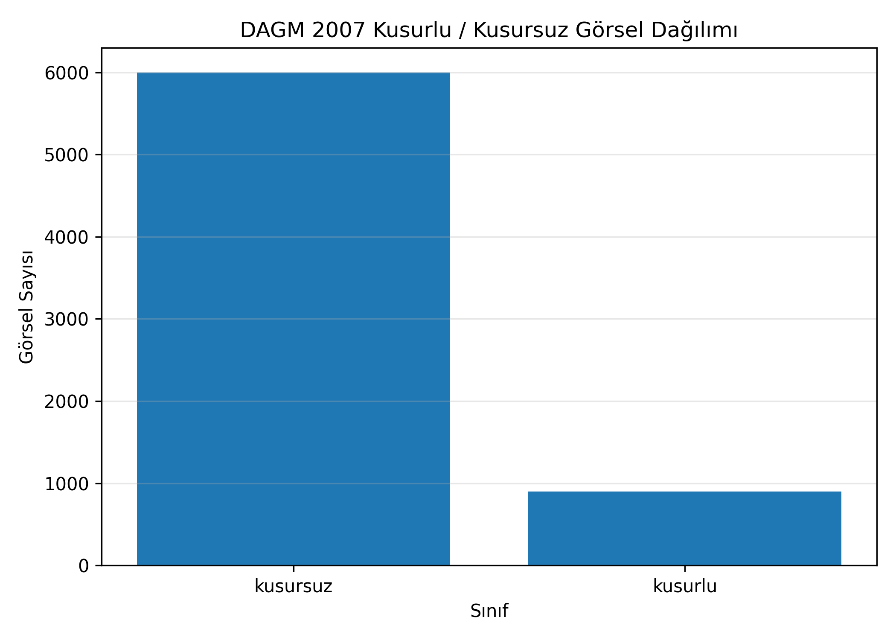
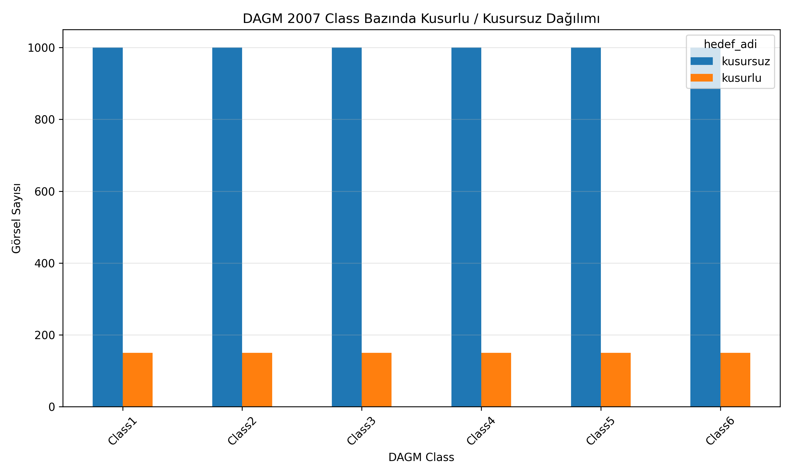
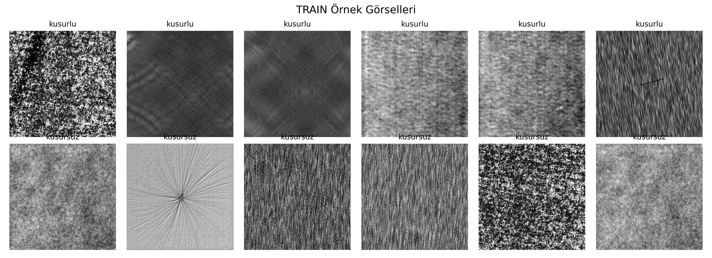
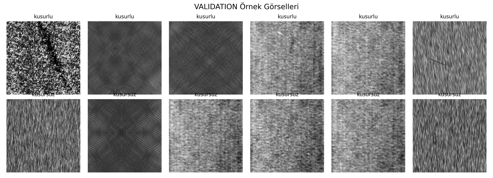
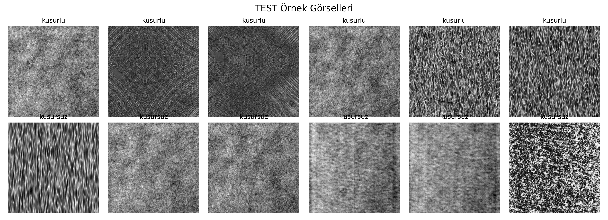
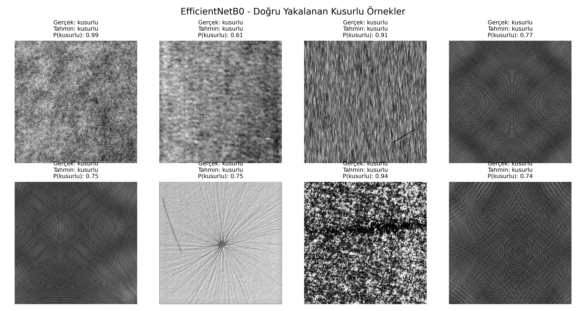
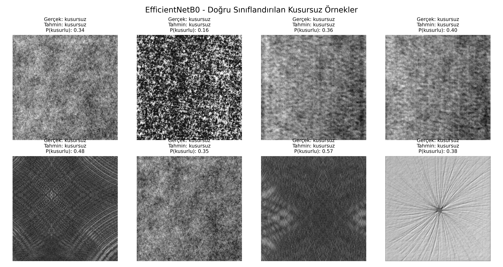
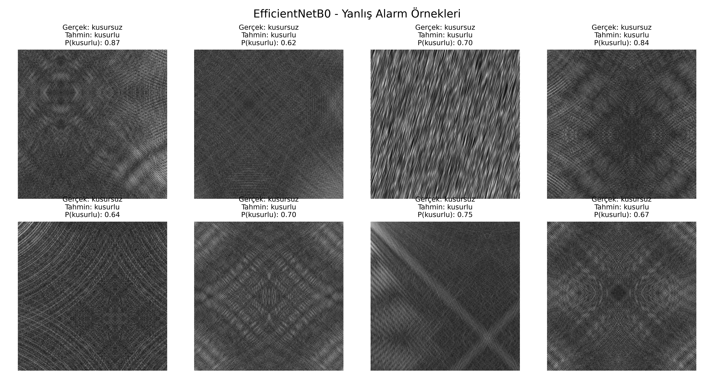

# DAGM 2007 Kusur Tespiti Derin Öğrenme Projesi

Bu proje, derin öğrenme dersi kapsamında hazırlanmış bir görüntü sınıflandırma çalışmasıdır. Projede DAGM 2007 veri seti kullanılarak endüstriyel yüzey görüntülerinde **kusurlu / kusursuz** sınıflandırma yapılmıştır.

Çalışmanın temel amacı, üretim hatlarında karşılaşılabilecek yüzey kusurlarını görüntü işleme ve derin öğrenme yöntemleriyle otomatik olarak tespit edebilen bir model geliştirmektir.

Projede hem sıfırdan oluşturulan CNN modelleri hem de hazır bir derin öğrenme modeli olan **EfficientNetB0 Transfer Learning** yaklaşımı denenmiştir. Modeller; accuracy, precision, recall, F1-score, confusion matrix ve threshold analizi gibi metriklerle karşılaştırılmıştır.

## Görsel Özet

Aşağıdaki görseller, projenin veri analizi, ön işleme, model karşılaştırması ve final tahmin sonuçlarını özetlemektedir.

| Aşama | Görsel |
|---|---|
| Veri seti sınıf dengesizliği |  |
| Class bazında kusurlu/kusursuz dağılım |  |
| Ön işleme sonrası veri bölümü |  |
| Final model karşılaştırması |  |

---

---

## 1. Projenin Amacı

Endüstriyel üretimde kalite kontrol süreçleri büyük önem taşımaktadır. Üretim sırasında oluşan yüzey kusurlarının manuel olarak tespit edilmesi zaman alıcı, maliyetli ve insan hatasına açık bir süreçtir.

Bu projede amaç:

- Görüntülerden kusurlu ve kusursuz örnekleri ayırmak
- Sınıf dengesizliği bulunan bir veri setinde uygun model stratejileri denemek
- Kendi CNN modelleri ile hazır model transfer learning yaklaşımını karşılaştırmak
- En başarılı modeli belirlemek
- Model performansını sadece accuracy ile değil, özellikle kusurlu sınıf için precision, recall ve F1-score ile değerlendirmek
- Endüstriyel kusur tespiti problemine uygun yorumlanabilir çıktılar üretmek

Bu problemde özellikle **kusurlu görüntülerin yakalanması** önemlidir. Çünkü gerçek bir kalite kontrol senaryosunda kusurlu bir ürünün kusursuz olarak sınıflandırılması kritik bir hatadır.

---

## 2. Kullanılan Veri Seti

Projede **DAGM 2007** veri seti kullanılmıştır. Bu veri seti, endüstriyel yüzey görüntülerinde kusur tespiti amacıyla kullanılan görsellerden oluşmaktadır.

Bu projede veri setindeki 6 sınıf kullanılmıştır:

- Class1
- Class2
- Class3
- Class4
- Class5
- Class6

Her sınıf içerisinde görüntüler genel olarak `Train` ve `Test` klasörleri altında bulunmaktadır. Ayrıca kusurlu görüntüler için ilgili `Label` klasörlerinde maske dosyaları yer almaktadır.

Bu çalışmada problem, çok sınıflı bir sınıflandırma problemi olarak değil, **ikili sınıflandırma** problemi olarak ele alınmıştır:

- **kusurlu**
- **kusursuz**

---

## 3. Etiketleme Mantığı

DAGM 2007 veri setinde kusurlu görüntüler için maske/label dosyaları bulunmaktadır. Bu projede etiketleme yapılırken aşağıdaki mantık kullanılmıştır:

- Görüntüye ait label/mask dosyası varsa: **kusurlu**
- Görüntüye ait label/mask dosyası yoksa: **kusursuz**

Bu işlem sonucunda her görüntü için bir manifest tablosu oluşturulmuştur.

Manifest tablosunda yer alan temel sütunlar:

- `class`
- `split`
- `dosya_adi`
- `image_path`
- `label_dosyasi`
- `label_path`
- `hedef`
- `hedef_adi`

Etiket anlamı:

```text
0 = kusursuz
1 = kusurlu
```

---

## 4. Veri Seti Dağılımı

İlk analiz sonucunda toplam veri sayısı:

```text
Toplam görsel sayısı: 6900
```

Orijinal veri dağılımı:

```text
Train: 3450
Test: 3450
```

Hedef sınıf dağılımı:

```text
Kusursuz: 6000
Kusurlu: 900
```

Bu dağılım veri setinde ciddi bir sınıf dengesizliği olduğunu göstermektedir. Kusursuz sınıf, kusurlu sınıfa göre çok daha fazladır.

Bu nedenle model değerlendirmesinde sadece accuracy metriği kullanılmamış; özellikle kusurlu sınıf için precision, recall ve F1-score değerleri dikkate alınmıştır.

### Veri Seti Genel Kusurlu / Kusursuz Dağılımı

Aşağıdaki grafik, veri setindeki genel sınıf dengesizliğini göstermektedir. Kusursuz örnek sayısının kusurlu örnek sayısına göre çok daha fazla olduğu görülmektedir.


### Class Bazında Kusurlu / Kusursuz Dağılım

Aşağıdaki grafik, Class1-Class6 için kusurlu ve kusursuz görüntü sayılarını göstermektedir. Her class içinde benzer oranda sınıf dengesizliği olduğu görülmektedir.


---

## 5. Veri Ön İşleme Süreci

Veri ön işleme aşamasında aşağıdaki işlemler yapılmıştır:

1. Ham veri seti Google Drive ortamına yüklendi.
2. Veri seti klasör yapısı kontrol edildi.
3. Her sınıf için Train ve Test klasörleri tarandı.
4. Label klasörleri kontrol edilerek görüntüler kusurlu / kusursuz olarak etiketlendi.
5. Manifest tablosu oluşturuldu.
6. Orijinal Train verisi içinden validation set ayrıldı.
7. Orijinal Test bölümü final test seti olarak korundu.
8. Görseller model eğitimine uygun klasör yapısına kopyalandı.
9. Train / validation / test klasörleri altında kusurlu ve kusursuz alt klasörleri oluşturuldu.
10. Veri dağılımını gösteren grafikler ve tablolar kaydedildi.

Ön işleme sonrası oluşan veri dağılımı:

```text
TRAIN
kusurlu: 357
kusursuz: 2403
Toplam: 2760

VALIDATION
kusurlu: 89
kusursuz: 601
Toplam: 690

TEST
kusurlu: 454
kusursuz: 2996
Toplam: 3450
```

Bu aşamada test seti orijinal haliyle korunmuştur. Böylece final model değerlendirmesi, eğitim sürecinde kullanılmamış bağımsız bir test seti üzerinde yapılmıştır.

### Ön İşleme Sonrası Train / Validation / Test Dağılımı

Aşağıdaki grafik, ön işleme sonrasında oluşan train, validation ve test veri bölümlerinin toplam görsel sayılarını göstermektedir.


---

## 6. Proje Klasör Yapısı

```text
DerinModel/
├── 01_veri_seti/
│   ├── ham_veri/
│   ├── islenmis_veri/
│   └── orijinal_indirilen_veri/
├── 02_notebooklar/
│   ├── 01_veri_seti_analizi.ipynb
│   ├── 02_veri_on_isleme.ipynb
│   ├── 03_kendi_cnn_modeli.ipynb
│   └── 04_hazir_model_transfer_learning.ipynb
├── 03_ciktilar/
│   ├── grafikler/
│   ├── tablolar/
│   ├── ornek_gorseller/
│   └── model_ozetleri/
├── 04_modeller/
│   ├── kendi_cnn_modeli/
│   └── hazir_modeller/
├── .gitignore
└── README.md
```

Not: Büyük veri seti klasörleri GitHub'a yüklenmemiştir. Veri seti boyutu büyük olduğu için `.gitignore` ile hariç tutulmuştur.

---

## 7. Notebook Dosyalarının Görevleri

### 7.1. `01_veri_seti_analizi.ipynb`

Bu notebookta veri seti incelenmiştir.

Yapılan işlemler:

- Veri seti klasör yapısının kontrolü
- Class1-Class6 klasörlerinin incelenmesi
- Train/Test dağılımlarının çıkarılması
- Label klasörlerinin kontrol edilmesi
- Kusurlu/kusursuz dağılımlarının hesaplanması
- Sınıf bazlı dağılım grafiklerinin oluşturulması
- Train ve Test setleri arasındaki yakın benzerlik kontrolü

### 7.2. `02_veri_on_isleme.ipynb`

Bu notebookta model eğitimine hazır veri yapısı oluşturulmuştur.

Yapılan işlemler:

- Manifest dosyasının oluşturulması
- Train verisinden validation set ayrılması
- İşlenmiş veri klasör yapısının oluşturulması
- Görsellerin yeni klasör yapısına kopyalanması
- Train / validation / test sayımlarının kontrol edilmesi
- Ön işleme özet tablolarının kaydedilmesi
- Ön işleme grafiklerinin oluşturulması
- Örnek görsellerin kaydedilmesi

Model eğitimi için oluşturulan yapı:

```text
islenmis_veri/
├── train/
│   ├── kusurlu/
│   └── kusursuz/
├── validation/
│   ├── kusurlu/
│   └── kusursuz/
└── test/
    ├── kusurlu/
    └── kusursuz/
```

### 7.2.1. Ön İşleme Sonrası Örnek Görseller

Ön işleme sonucunda oluşturulan train, validation ve test klasörlerinden örnek görseller kaydedilmiştir. Bu görseller, modelin hangi tip yüzey dokuları üzerinde eğitildiğini ve değerlendirildiğini göstermektedir.

#### Train Örnek Görselleri



#### Validation Örnek Görselleri



#### Test Örnek Görselleri



### 7.3. `03_kendi_cnn_modeli.ipynb`

Bu notebookta sıfırdan oluşturulan CNN modelleri eğitilmiştir.

Denenen modeller:

1. Regularized CNN
2. Balanced Batch CNN
3. Focal Loss CNN

Bu modellerde aşağıdaki yöntemler kullanılmıştır:

- Conv2D katmanları
- BatchNormalization
- MaxPooling2D
- Dropout
- L2 regularization
- GlobalAveragePooling2D
- Data augmentation
- Class weight
- Balanced batch strategy
- Focal Loss
- Threshold analizi
- Confusion matrix
- Classification report

### 7.4. `04_hazir_model_transfer_learning.ipynb`

Bu notebookta transfer learning yaklaşımı uygulanmıştır.

Kullanılan model:

```text
EfficientNetB0
```

Yapılan işlemler:

- EfficientNetB0 modelinin yüklenmesi
- ImageNet ağırlıklarının kullanılması
- Base modelin frozen olarak ayarlanması
- Yeni sınıflandırma katmanlarının eklenmesi
- Class weight kullanımı
- Model eğitimi
- Test seti değerlendirmesi
- Threshold analizi
- Final threshold seçimi
- Final model karşılaştırması
- Model özetlerinin kaydedilmesi

---

## 8. Kullanılan Derin Öğrenme Yöntemleri

### 8.1. Normalizasyon

Görüntü piksel değerleri model eğitimine uygun hale getirilmiştir. Kendi CNN modellerinde `Rescaling` katmanı kullanılmıştır.

### 8.2. Data Augmentation

Modelin ezberlemesini azaltmak ve genelleme başarısını artırmak için veri artırma işlemleri uygulanmıştır.

### 8.3. Dropout

Overfitting riskini azaltmak için dropout katmanları kullanılmıştır.

### 8.4. Batch Normalization

Eğitimi daha kararlı hale getirmek için batch normalization katmanları kullanılmıştır.

### 8.5. L2 Regularization

Ağırlıkların aşırı büyümesini engellemek ve ezberlemeyi azaltmak için L2 regularization uygulanmıştır.

### 8.6. Class Weight

Veri setinde kusurlu sınıf sayısı kusursuz sınıfa göre daha az olduğu için class weight kullanılmıştır.

### 8.7. Balanced Batch Training

İkinci CNN modelinde batch içerisindeki sınıf dengesini iyileştirmek için balanced batch yaklaşımı denenmiştir.

### 8.8. Focal Loss

Üçüncü CNN modelinde azınlık sınıf olan kusurlu sınıfa daha fazla odaklanmak için focal loss kullanılmıştır.

### 8.9. Transfer Learning

Hazır model yaklaşımında EfficientNetB0 kullanılmıştır. ImageNet üzerinde öğrenilmiş özellikler bu projeye aktarılmıştır.

---

## 9. Kendi CNN Modelleri

### 9.1. Model 1: Regularized CNN

İlk model sıfırdan oluşturulan temel CNN modelidir.

Modelde kullanılan temel katmanlar:

- Input
- Rescaling
- Data augmentation
- Conv2D
- BatchNormalization
- MaxPooling2D
- Dropout
- GlobalAveragePooling2D
- Dense
- Sigmoid output

Kayıp fonksiyonu:

```text
binary_crossentropy
```

Optimizer:

```text
Adam
```

Test sonuçları:

```text
Accuracy: 0.8661
Kusurlu Precision: 0.4718
Kusurlu Recall: 0.1476
Kusurlu F1-score: 0.2248
Threshold: 0.50
```

Yorum:

Bu modelin accuracy değeri yüksek görünmektedir. Ancak kusurlu sınıf recall değeri oldukça düşüktür. Bu durum modelin gerçek kusurlu örneklerin büyük kısmını kusursuz olarak sınıflandırdığını göstermektedir. Bu nedenle model, kalite kontrol problemi için yeterli görülmemiştir.

### 9.2. Model 2: Balanced Batch CNN

İkinci modelde sınıf dengesizliğini azaltmak amacıyla balanced batch stratejisi uygulanmıştır.

Test sonuçları:

```text
Accuracy: 0.8843
Kusurlu Precision: 0.8985
Kusurlu Recall: 0.1366
Kusurlu F1-score: 0.2371
Threshold: 0.50
```

Yorum:

Bu modelde kusurlu precision değeri oldukça yüksektir. Yani model bir görüntüye kusurlu dediğinde çoğunlukla doğru karar vermektedir. Ancak kusurlu recall değeri çok düşüktür. Model gerçek kusurlu örneklerin çoğunu kaçırmıştır.

### 9.3. Model 3: Focal Loss CNN

Üçüncü CNN modelinde focal loss kullanılmıştır. Bu yöntemin amacı, modelin zor ve azınlık sınıf örneklerine daha fazla odaklanmasını sağlamaktır. Ayrıca bu modelde görüntü boyutu 256x256 olarak kullanılmıştır.

Seçilen threshold:

```text
0.40
```

Test sonuçları:

```text
Accuracy: 0.4939
Kusurlu Precision: 0.1670
Kusurlu Recall: 0.7137
Kusurlu F1-score: 0.2707
```

Yorum:

Bu model kusurlu sınıf recall değerini yükseltmiştir. Ancak bunun karşılığında çok fazla yanlış alarm üretmiştir. Bu nedenle recall yüksek olsa da genel performans dengeli değildir.

---

### 9.4. Kendi CNN Modellerinin Görsel Karşılaştırması

Aşağıdaki grafik, sıfırdan oluşturulan üç CNN modelinin accuracy, kusurlu recall ve kusurlu F1-score metrikleri açısından karşılaştırmasını göstermektedir.


Grafikten görüldüğü gibi ilk iki model accuracy açısından daha yüksek görünse de kusurlu sınıfı yakalama oranları düşüktür. Focal Loss CNN modeli kusurlu recall değerini artırmış ancak genel doğruluk ve yanlış alarm dengesi açısından yeterli seviyeye ulaşamamıştır.

## 10. EfficientNetB0 Transfer Learning Modeli

Final aşamada EfficientNetB0 Transfer Learning modeli kullanılmıştır.

EfficientNetB0, ImageNet veri seti üzerinde önceden eğitilmiş bir CNN modelidir. Bu projede modelin gövdesi özellik çıkarıcı olarak kullanılmıştır.

Modelin genel yapısı:

- Input: 224x224x3
- Data augmentation
- EfficientNetB0 base model
- GlobalAveragePooling2D
- Dropout
- Dense
- BatchNormalization
- Sigmoid output

Eğitim stratejisi:

- ImageNet ağırlıkları kullanılmıştır.
- Base model başlangıçta frozen tutulmuştur.
- Class weight uygulanmıştır.
- Early stopping kullanılmıştır.
- ReduceLROnPlateau kullanılmıştır.
- Threshold analizi yapılmıştır.

Test sonuçları:

```text
Accuracy: 0.8986
Kusurlu Precision: 0.6221
Kusurlu Recall: 0.5837
Kusurlu F1-score: 0.6023
Threshold: 0.60
```

Confusion matrix:

```text
Gerçek Kusursuz - Tahmin Kusursuz: 2835
Gerçek Kusursuz - Tahmin Kusurlu: 161
Gerçek Kusurlu - Tahmin Kusursuz: 189
Gerçek Kusurlu - Tahmin Kusurlu: 265
```

Yorum:

EfficientNetB0 modeli, kendi CNN modellerine göre daha dengeli sonuç vermiştir. Hem accuracy hem de kusurlu sınıf F1-score açısından en başarılı model olmuştur. Bu nedenle final model olarak EfficientNetB0 Transfer Learning modeli seçilmiştir.

### EfficientNetB0 Final Confusion Matrix

Final model için threshold değeri 0.60 olarak seçilmiştir. Bu threshold değerinde model, kusurlu sınıf için daha dengeli precision / recall oranı sağlamıştır.


Bu matriste:

- 2835 kusursuz görüntü doğru şekilde kusursuz tahmin edilmiştir.
- 161 kusursuz görüntü yanlışlıkla kusurlu tahmin edilmiştir.
- 189 kusurlu görüntü kaçırılmıştır.
- 265 kusurlu görüntü doğru şekilde kusurlu tahmin edilmiştir.

---

## 11. Model Karşılaştırması

| Model | Yöntem | Threshold | Accuracy | Kusurlu Precision | Kusurlu Recall | Kusurlu F1 |
|---|---|---:|---:|---:|---:|---:|
| Kendi CNN Model 1 | Regularized CNN | 0.50 | 0.8661 | 0.4718 | 0.1476 | 0.2248 |
| Kendi CNN Model 2 | Balanced Batch CNN | 0.50 | 0.8843 | 0.8985 | 0.1366 | 0.2371 |
| Kendi CNN Model 3 | Focal Loss CNN | 0.40 | 0.4939 | 0.1670 | 0.7137 | 0.2707 |
| EfficientNetB0 | Transfer Learning | 0.60 | 0.8986 | 0.6221 | 0.5837 | 0.6023 |

---

### 11.1. Final Model Karşılaştırma Grafiği

Aşağıdaki grafik, kendi CNN modelleri ile EfficientNetB0 Transfer Learning modelini ortak metrikler üzerinden karşılaştırmaktadır.


Grafikte görüldüğü gibi EfficientNetB0 modeli, accuracy ve kusurlu F1-score açısından en dengeli sonucu üretmiştir. Bu nedenle final model olarak seçilmiştir.

## 12. Final Model Seçimi

Final model olarak:

```text
EfficientNetB0 Transfer Learning
```

seçilmiştir.

Seçilme nedenleri:

- En yüksek genel başarıya yakın sonucu vermesi
- Kusurlu sınıf için en dengeli precision / recall oranını sağlaması
- Kendi CNN modellerine göre daha yüksek F1-score üretmesi
- Transfer learning sayesinde daha güçlü özellik çıkarımı yapması
- Threshold 0.60 ile dengeli bir karar sınırı sağlaması

Final model performansı:

```text
Accuracy: 0.8986
Kusurlu Precision: 0.6221
Kusurlu Recall: 0.5837
Kusurlu F1-score: 0.6023
Threshold: 0.60
```

---

## 13. Proje Çıktıları

### 13.1. Tablolar

`03_ciktilar / tablolar` klasöründe:

- Veri seti manifest dosyaları
- Train / validation / test dağılım tabloları
- Class weight tabloları
- Classification report dosyaları
- Threshold analiz tabloları
- Final model karşılaştırma tablosu
- Final sonuç özetleri

### 13.2. Grafikler

`03_ciktilar / grafikler` klasöründe:

- Veri seti dağılım grafikleri
- Ön işleme dağılım grafikleri
- Confusion matrix görselleri
- Threshold seçimi sonrası confusion matrix grafikleri
- Final model karşılaştırma grafikleri

### 13.3. Örnek Görseller

`03_ciktilar / ornek_gorseller` klasöründe:

- Train örnek görselleri
- Validation örnek görselleri
- Test örnek görselleri
- EfficientNetB0 doğru tahmin örnekleri
- Kaçan kusurlu örnekler
- Yanlış alarm örnekleri
- Doğru sınıflandırılan kusursuz örnekler

### 13.3.1. EfficientNetB0 Örnek Tahmin Görselleri

Final modelin test seti üzerindeki davranışını daha net göstermek için doğru yakalanan kusurlu örnekler, doğru sınıflandırılan kusursuz örnekler ve yanlış alarm örnekleri ayrıca görselleştirilmiştir.

#### Doğru Yakalanan Kusurlu Örnekler

Bu görselde gerçek etiketi kusurlu olan ve model tarafından doğru şekilde kusurlu tahmin edilen örnekler gösterilmektedir.



#### Doğru Sınıflandırılan Kusursuz Örnekler

Bu görselde gerçek etiketi kusursuz olan ve model tarafından doğru şekilde kusursuz tahmin edilen örnekler gösterilmektedir.



#### Yanlış Alarm Örnekleri

Bu görselde gerçek etiketi kusursuz olduğu halde model tarafından kusurlu olarak tahmin edilen örnekler gösterilmektedir. Bu örnekler, modelin bazı yüzey dokularını kusur gibi algılayabildiğini göstermesi açısından önemlidir.



### 13.4. Model Özetleri

`03_ciktilar / model_ozetleri` klasöründe:

- Detaylı model değerlendirme raporu
- Markdown model özeti
- Model karşılaştırma tabloları

### 13.5. Eğitilmiş Modeller

`04_modeller` klasöründe eğitilmiş model dosyaları bulunmaktadır.

Model dosyaları `.keras` formatında kaydedilmiştir. Bu dosyalar Google Drive veya VS Code içinde metin gibi açılmaz. Çünkü bu dosyalar binary model dosyalarıdır.

Kayıtlı modeller:

```text
dagm_2007_kendi_cnn_regularized_best_model.keras
dagm_2007_balanced_cnn_best_model.keras
dagm_2007_focal_cnn_best_model.keras
dagm_2007_efficientnetb0_transfer_best_model.keras
```

---

## 14. README Görsellerinin Gösterilmesi İçin Not

README içinde kullanılan görseller repository içerisindeki göreli dosya yollarıyla eklenmiştir. Bu nedenle GitHub üzerinde görsellerin görünmesi için aşağıdaki klasör ve dosyaların repository içinde bulunması gerekir:

```text
03_ciktilar/grafikler/01_veri_seti_analizi/
03_ciktilar/grafikler/2_on_isleme/
03_ciktilar/grafikler/3_kendi_cnn_modeli/
03_ciktilar/grafikler/4_hazir_model_sonuclari/
03_ciktilar/ornek_gorseller/
```

Görseller GitHub'a pushlandıktan sonra README üzerinde otomatik olarak görüntülenecektir.

## 15. GitHub İçeriği Hakkında Not

Bu projede ham veri seti ve işlenmiş veri seti GitHub'a yüklenmemiştir. Bunun nedeni veri seti dosyalarının boyutunun büyük olmasıdır.

GitHub'a yüklenen temel içerikler:

- Notebook dosyaları
- Grafik çıktıları
- Tablo çıktıları
- Model özetleri
- Örnek görseller
- Eğitilmiş model dosyaları
- README.md
- .gitignore

GitHub'a yüklenmeyen içerikler:

- Ham veri seti
- İşlenmiş veri seti
- Orijinal indirilen büyük veri dosyaları

Bu klasörler `.gitignore` dosyasıyla hariç tutulmuştur.

---

## 16. Sonuç

Bu çalışmada DAGM 2007 veri seti üzerinde kusurlu / kusursuz sınıflandırma problemi ele alınmıştır.

Öncelikle veri seti analiz edilmiş, sınıf dengesizliği tespit edilmiş ve model eğitimine uygun bir klasör yapısı oluşturulmuştur. Daha sonra sıfırdan CNN modelleri eğitilmiş, sınıf dengesizliğine karşı class weight, balanced batch ve focal loss gibi yöntemler denenmiştir.

Kendi CNN modelleri bazı metriklerde başarılı görünse de kusurlu sınıfı dengeli şekilde yakalamakta yetersiz kalmıştır. Focal Loss modeli recall değerini artırmış ancak yanlış alarm sayısını yükseltmiştir.

Son aşamada EfficientNetB0 Transfer Learning modeli kullanılmıştır. Bu model, accuracy ve kusurlu sınıf F1-score açısından en dengeli sonucu verdiği için final model olarak seçilmiştir.

Final seçilen model:

```text
EfficientNetB0 Transfer Learning
```

Final threshold:

```text
0.60
```

Final performans:

```text
Accuracy: 0.8986
Kusurlu Precision: 0.6221
Kusurlu Recall: 0.5837
Kusurlu F1-score: 0.6023
```

Bu sonuçlara göre proje hedefi olan endüstriyel yüzey kusur tespiti için en uygun model EfficientNetB0 Transfer Learning modeli olarak belirlenmiştir.
